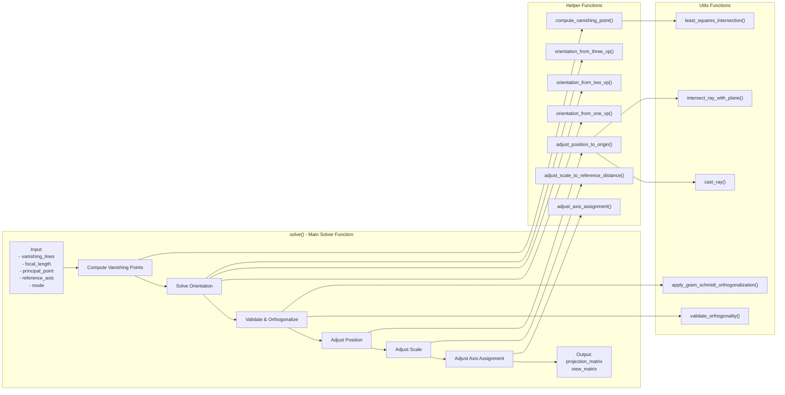
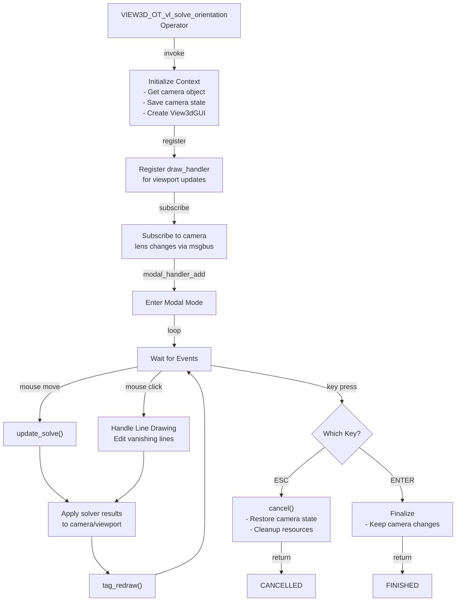
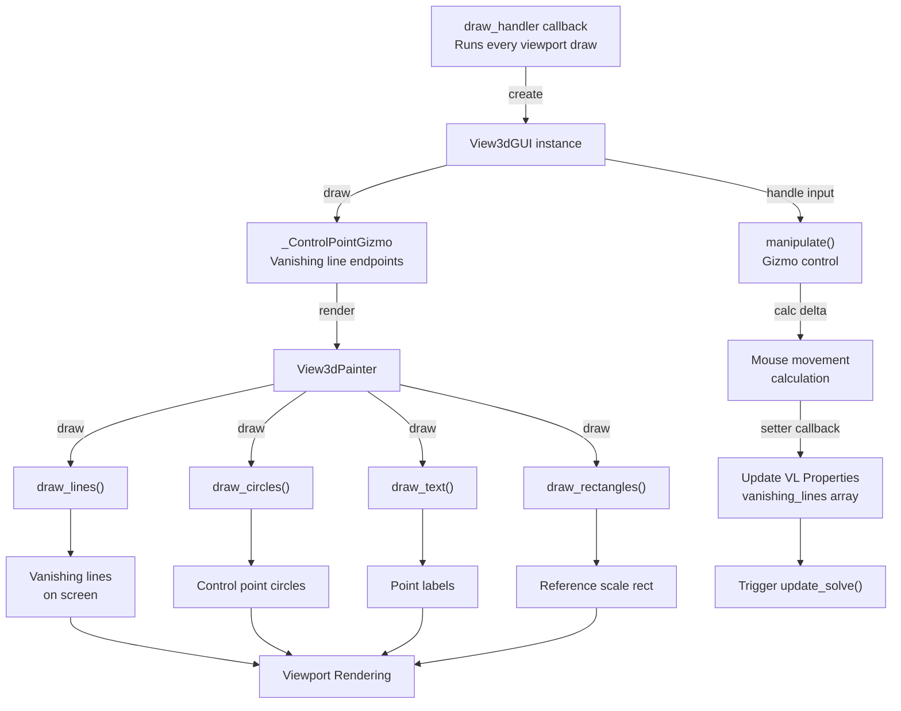
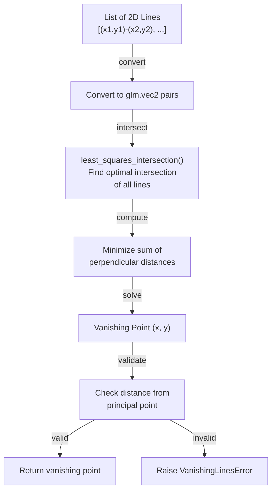
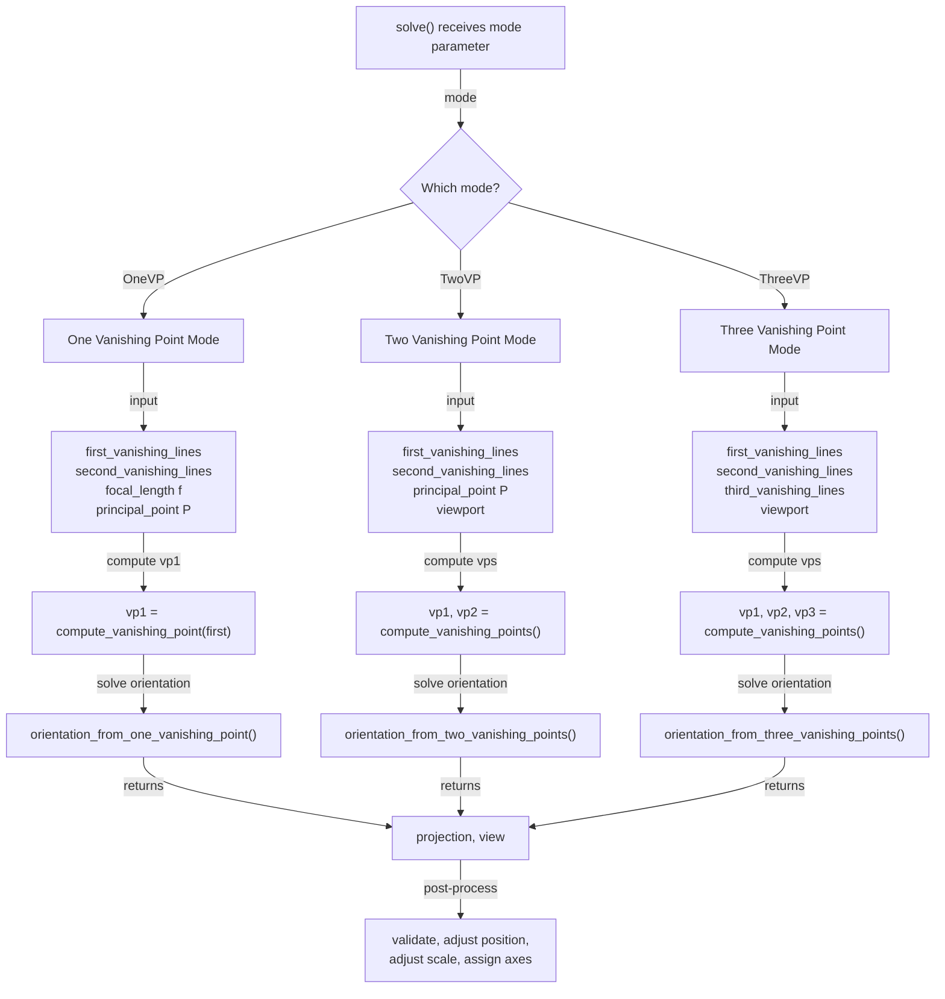
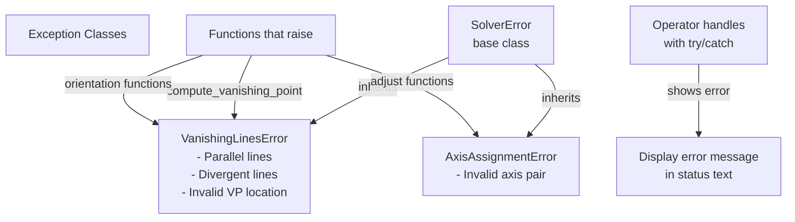

# Vanishing Lines for Blender - Function Call Diagram

## Main Entry Points and Call Flow

```mermaid
graph TD
    A["Blender Event<br/>Modal Operator Invoked"] -->|invoke()| B["VIEW3D_OT_vl_solve_orientation"]
    
    B -->|modal()| C["Handle User Input<br/>Mouse/Keyboard Events"]
    C -->|mouse drag| D["Draw Vanishing Lines<br/>on View3D"]
    C -->|settings change| E["update_solve()"]
    
    E -->|calls| F["solver.core.solve()"]
    F -->|mode matching| G{"Solve Mode"}
    
    G -->|OneVP| H["compute_vanishing_point()"]
    G -->|TwoVP| H
    G -->|ThreeVP| H
    
    H -->|intersect lines| I["utils.least_squares_intersection()"]
    
    G -->|OneVP| J["orientation_from_one_vanishing_point()"]
    G -->|TwoVP| K["orientation_from_two_vanishing_points()"]
    G -->|ThreeVP| L["orientation_from_three_vanishing_points()"]
    
    J -->|returns| M["projection, view matrices"]
    K -->|returns| M
    L -->|returns| M
    
    M -->|validate| N["utils.validate_orthogonality()"]
    N -->|invalid| O["utils.apply_gram_schmidt_orthogonalization()"]
    
    M -->|adjust position| P["adjust_position_to_origin()"]
    P -->|returns| Q["updated view matrix"]
    
    Q -->|if reference axis| R["adjust_scale_to_reference_distance()"]
    R -->|returns| S["scaled view matrix"]
    
    S -->|assign axes| T["adjust_axis_assignment()"]
    T -->|returns| U["axis-assigned view matrix"]
    
    U -->|translate| V["glm.translate()"]
    V -->|returns final| W["Final: projection, view matrices"]
    
    W -->|apply to camera| X["vl_utils.apply_solver_results_to_blender_camera()"]
    X -->|set camera transform| Y["Blender Camera Object Updated"]
    
    W -->|apply to view3d| Z["vl_utils.apply_solver_results_to_view3d()"]
    Z -->|set view3d transform| AA["View3D Viewport Updated"]
    
    E -->|draw UI| AB["View3dGUI class"]
    AB -->|render| AC["View3dPainter.draw_*()"]
    AC -->|viewport draw| AD["Display Vanishing Lines & Controls"]
```

---

## Solver Core Components



---

## Operator Flow



---

## View3D UI/Drawing Flow



---

## Vanishing Point Computation



---

## Solver Mode Decision Tree



---

## Key Data Structures

```mermaid
graph TD
    SUBGRAPH1["Input Data Structures"]
    
    VL["Line2<br/>= Tuple[Point2, Point2]<br/>= Tuple[Tuple[float,float],<br/>Tuple[float,float]]"]
    
    RECT["Rect<br/>x: float<br/>y: float<br/>width: float<br/>height: float"]
    
    AXIS["Axis enum<br/>PositiveX, NegativeX<br/>PositiveY, NegativeY<br/>PositiveZ, NegativeZ"]
    
    MODE["SolverMode enum<br/>OneVP, TwoVP, ThreeVP"]
    
    REFAX["ReferenceAxis enum<br/>X_Axis, Y_Axis, Z_Axis<br/>Screen"]
    
    SUBGRAPH2["Output Data Structures"]
    
    PROJ["projection: glm.mat4<br/>4x4 projection matrix"]
    
    VIEW["view: glm.mat4<br/>4x4 view/camera matrix"]
    
    PROPS["VL Properties<br/>mode: str<br/>fovx: float<br/>first_axis: Axis<br/>second_axis: Axis<br/>reference_scale_mode<br/>reference_screen_segment"]
```



---

## Exception Handling



