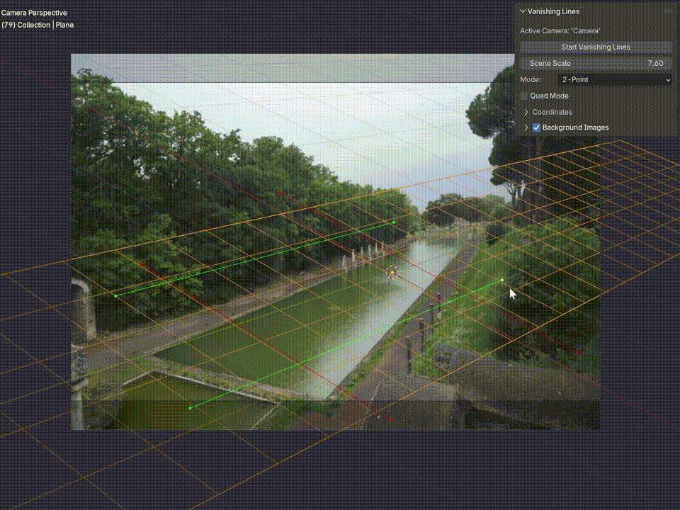

# Vanishing Lines _for Blender_

A Blender add-on for aligning your camera’s perspective using vanishing lines.
__work in progress__

## Usage
- when the addon is installed, open the VL sidepanel and click on Start Vanishing Lines Button.
- add a background to the camera
- select 1,2 or 3 mode vanishing points
- move the vanishing line endpoints to match the camera to the background

## TODO, ChangeLog

###
- [ ] ADD draw antialiased lines, and circles shader

###
- [ ] ADD align tracked camera
- [ ] ADD animation
- [ ] ADD Loupe

##
- [ ] test with blender's python.
      add to 'settings.json': "python.defaultInterpreterPath": "C:\\Program Files\\Blender Foundation\\Blender 4.5\\4.5\\python\\bin\\python.exe"

### 
- [ ] active camera selection, must be obvious in the sidepanel. All panels operators must woirk on the active camera. we have to store the working camera somewhere, so all the ui panels can access it and work on the same one.
  - in the ui we could select options to determine the active amera, or for now, experience with them: 
    - scene.camera
    - get the camera if the viewer is looking throiugh one
    - select a camera from a list of cameras to work on, than make sure, the viewer is looking through.
    - what i fmultiple cameras or multiple viewers are on the screen? !!!

- [ ] test user interfgace and find bugs
- [ ] see what else can be tested without blender

### **0.7..**
- [ ] ~~REFACTOR coordinate space conversion~~
- [ ] ~~better handle warnings.warn in the UI?~~
- [ ] ADD Start, Pause, Stop modal operator
- [x] ADD UI for the background image to our panel
- [x] ADD UI under the CAMERA Parameters (camera_panel.py)

### **0.7.**
- [ ] ~~Test UIView controls?~~
- [?] ADD slow point drag with SHIFT
- [x] Test axis assignment (currently only support right handed coordinate systems)

### **0.7.**
- [x] FIX🛠️ while dragging controlpoints, move them with mouse instead of setting the coords to the mousepos
- [x] text on reference distance segment
- [x] ADD referende distance segment instead of a simple distance
- [x] FIX when a line is zero length, there is an unhandled error
- [x] show better error messages in the UI, and phrase them to be helpful.

### **0.7.6**
- [x] refactor control points

### **0.7.5.2
- [x] Set vanishing lines color based on the axis assignment axes
- [x] Double check axis sign, if it matches tha actual blender axes. the selected sign should go towards the vanishing points
- [x] ADD axis assignment

### **0.7.5.1
- [x] BUG FIXES
  - [x] FIX: Now, all the extended vanishing lines are drawn regardless of the active mode.
  - [x] FIX solve scale by origin distance->adjust_position_to_origin was slightly off

### **0.7.5
- [x] ADD tests for solve components
- [x] FIX reference is slightly off -> axis assignment and reference axis was applied in the wrong order.
- [x] add tests to unprojects
- [x] use the main _solver_ function in the operator
- [x] REFACTOR project/unproject between region and compute space to work with the new functions
- [x] reorganize the solver
- [x] FIX camera view frame
- [x] fix draw handler unregister

### **0.7.4
- [x] Add arbitrary axis to measure distance.
- [X] ADD set scale by camera to origin distance.
- [X] FIX reference distance mouse handling.

### **0.7.3
- [x] ADD reference distance controls to the viewport
- [x] FIX draw extended vanishing lines with new ControlPoints
- [x] REFACTOR: vl_params now use FloatVectors to represent points, and also Operator now mostly uses tuples instead of a glm.vec2
- [x] ADD hover color for new controlopoints
- [x] FIX🔥 quad mode for new Control Points
- [x] 🔧 refactor ControlPoints

### **0.7.2 - 2025-11-28**
- [x] FIX use _centered_, _square_ (fit to output rectangle) normalized coordinates.
- [x] FIX quad mode
- [x] refactor draw code to DrawLayer class
- [x] FIX Active and HOVER control point color
- [x] ADD draw vanishing lines extended to vanishing points
- [x] ADD draw horizon

### **0.7.2 - 2025-11-24**
- [x] ADD support three-point perspective mode
- [x] ADD manual principal point
- [x] FIX quad mode

### **0.7.1 - 2025-11-24**
**Added**
- [x] ADD quad mode for two-point perspective mode.
- [x] ADD manual principal point to TWO and THREE-Point mode
- [x] FIX use principal point for til_shift, and apply to blender camera
- [x] ADD solve three vanishing point mode
- [x] FIX mouse hittest: use the screen coords for mouse hittest
- [x] FIX start running VL modal operator
- [x] ADD solve two vanishing point
- [x] ADD solve single vanishing point